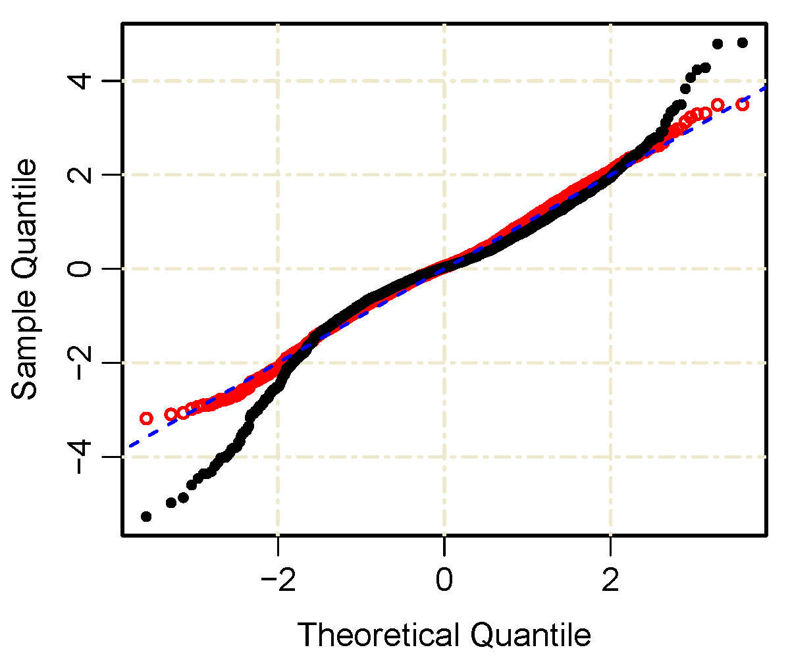

# NSVh-R
This is the set of R codes used for the numerical examples of __"Normal Stochastic Volatility Model"__ paper by Jaehyuk Choi([@jaehyukchoi](https://github.com/jaehyukchoi)), Chenru Liu, and Byoung Ki Seo.

## Paper Information
### Title 
Hyperbolic normal stochastic volatility model

### Abstract
For option pricing models and heavy-tailed distributions, this study proposes a continuous-time stochastic volatility model based on an arithmetic Brownian motion: a one-parameter extension of the normal stochastic alpha-beta-rho (SABR) model. Using two generalized Bougerol's identities in the literature, the study shows that our model has a closed-form Monte-Carlo simulation scheme and that the transition probability for one special case follows Johnson's SU distribution---a popular heavy-tailed distribution originally proposed without stochastic process. It is argued that the SU distribution serves as an analytically superior alternative to the normal SABR model because the two distributions are empirically similar.

### Links
[DOI](https://doi.org/10.1002/fut.21967) | [arXiv](https://arxiv.org/abs/1809.04035) | [SSRN](http://ssrn.com/abstract=3068836). ([arXiv](http://arxiv.org/abs/1809.04035) is recommended for free download of the latest version.)

## Files
* Figure 1
  

  
  

* Figure 3
  

  
  
  

* Figure 4
  

  
  
  

## Citation
__Choi, J., Liu, C., & Seo, B.K.__ (2019). Hyperbolic normal stochastic volatility model, *Journal of Futures Markets*, 39(2), 186-204. https://doi.org/10.1002/fut.21967
